 
<h1>Ana Lucia Bolico</h1>
<h3> [  <em>Software Engineer</em>  ] </h3>

    Hi there 👋! My name is Ana Lucia, but here you can call me Lucia.
I'm a Software Engineer in Portugal with a passion to develop highly scalable projects with quality and innovation.
Thank you for visiting my profile.
 

---

- 🔭 I'm Currently Working on [Capgemini Engineering](https://www.capgemini.com/pt-en/about-us/who-we-are/our-brands/capgemini-engineering)
- 👯 I'm looking to collaborate on a lib project (coming soon . . .)
- 📚 I'm Studying TypeScript, Node.js, Java, React, React Native, Flutter, and Python ...
- 🖇️ Visit my profile on [LinkTree](https://linktr.ee/bolic_)!
- 📫 Let's get social on [Discord](https://discordapp.com/users/analuciabolico#7783)!
- 🖇️ Also visit my [Linkedin](https://www.linkedin.com/in/analuciabolico)!
- ⚡ Fun fact! I love cold coffee ☕

---

<table>
  <tr>
    <th align="center">
      <h4>Stats</h4>
    </th>
    <th align="center">
      <h4>Languages</h4>
    </th>
  </tr>
  <tr>
    <td align="center">
      
    </td>
    <td align="center">
      
    </td>
  </tr>
</table>

---

 
